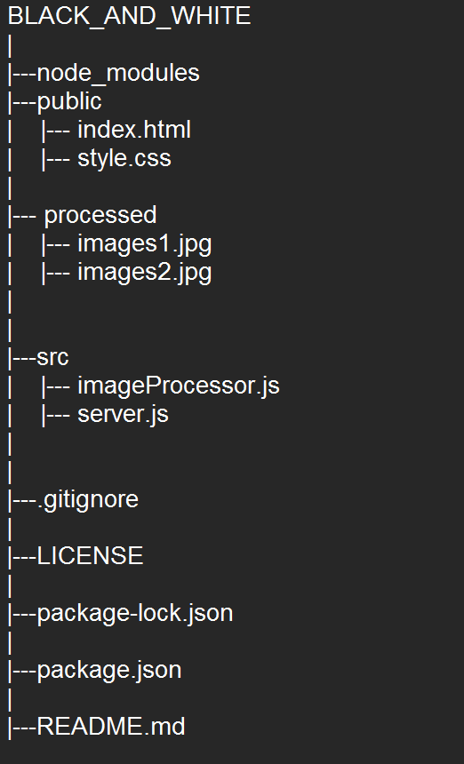

# Black_and_White

Simon Velasquez
https://github.com/siseveca79/Black_and_White

npm install express
npm install body-parser
npm install jimp
npm install uuid

cd src
Black_and_White\src>node server.js

